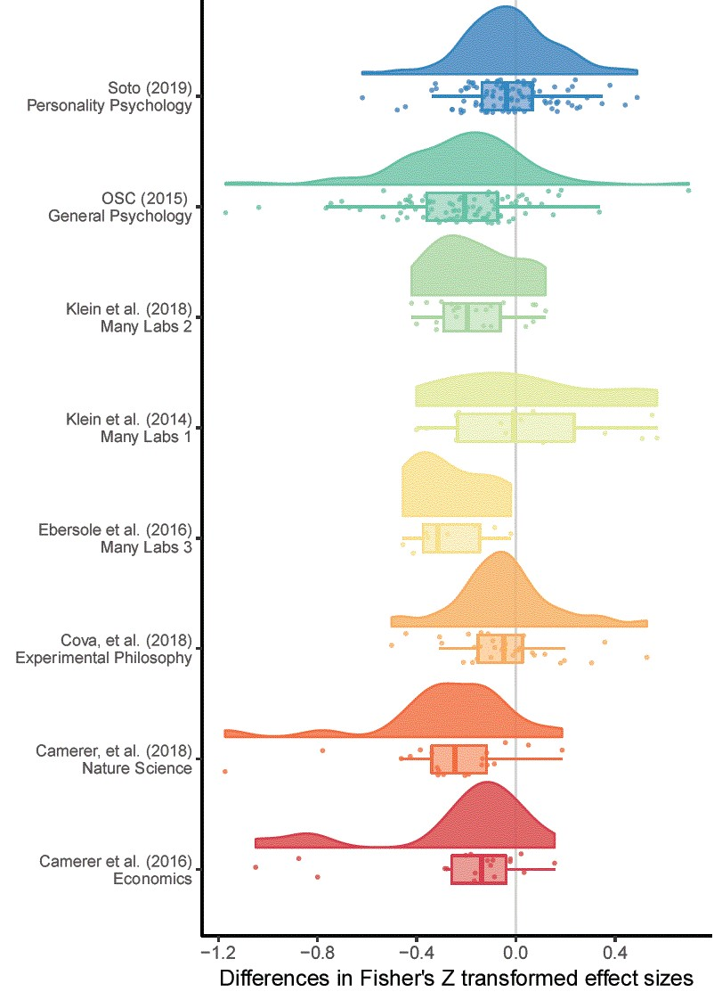

```{r message=FALSE, warning=FALSE, include=FALSE}
source(file = 'Data/data_collection_cleaning.R')
source(file = 'analysisScript.R')
options(scipen = 1, digits = 2)
knitr::opts_chunk$set(fig.width=8, fig.height=5, echo =FALSE) 
options(knitr.kable.NA = '')
```

## Introduction
See word document 

## Methods 
### Data extraction
All of the large scale replication projects that have been performed in behavioral science research were collected. The original source of each study, test statistics, effect sizes, sample sizes, standard errors, p-values were extracted for each original and replication study. Several of the large scale replication projects did not present the original test statistics and p values (e.g., Many labs 1 and 3). In these cases, these values were manually extracted from the original articles. When sample sizes for original studies were not available they were manually extracted from original articles. When the original and replication effect sizes were not reported as Fisher Z transformed correlation coefficients, effect sizes were converted from test statistics or effect sizes for analysis. In cases where sample sizes were not reported per group, equal sample sizes among groups were assumed to be equal in these estimates. See table one for the number of valid studies extracted from each project. All results are reported in correlation coefficients following {Open Science Collaboration, 2015 #611} in order to present results in a common metric which is likely intuitively understandable and familiar to most psychologists and behavioral researchers. 

Three studies which did not report that their findings were indicative of a true effect were excluded from {Open Science Collaboration, 2015 #611}. For the Nature Science reproducibility projects {Camerer, 2018 #967}, when multiple replication studies were run, a fixed effects meta-analysis was performed using the metafor package {Viechtbauer, 2010 #796} for each study to estimate the true effect. P values, standard errors and sample sizes reflect this pooled estimate. This method leads to one study more "replicating" according to the 'statistical significance in the same direction of the original study' than was originally reported in the nature science project, where they using the largest performed study instead of a pooled estimate.

In [LOOPR study CITATION], some measures used shorter form version of the original questionnaire, all results presented have been disattenuated using the Spearman-Brown prediction formula and Spearman disattenuation formula to estimate the trait-outcome associations that would be expected if our outcome measure had used the same number of items as the original study (Lord & Novick, 1968). Following the other large scale replication studies, the signs of negative original correlations were set to positive (and the sign of the replication sample were switched too). The experimental philosophy reproducibility project included two original studies which were non-significant (and which were not claimed to provide evidence for the effects under test), these were removed from analysis. Many labs 2 [CITATION] original p values were recalculated from reported summary statistics (i.e., from Cohen's d). Four studies from this reproducibility project were removed because effect sizes could not be simply derived (the original and replication studies examined a difference in effect sizes seen in different conditions, and the effects were not directly tested against each other), and two additional were excluded because their effect sizes were only available in Cohen's q.

INSERT TABLE 1 HERE

### Analysis

All analysis was performed in R {R Development Core Team, 2018 #314}. Mean raw differences along with Wald-type 95% confidence intervals around the mean difference, median effect size differences, and raw proportion decreases in effect sizes (i.e., $\frac{original ES_i - Replicaiton ES_i}{originalES_i}$) were calulcated on the Fisher-Z transformed effect sizes. The reported Wald-type confidence intervals do not account for non-independece between effects taken from the same paper, or between studies from the same replicaiton projects. In order to account for this non-independence, multilevel-meta-analysis framework was used. Any studies with missing data (e.g., missing effect sizes or sample sizes for the initial or replicaiton studies) were excluded, and sample sizes are reported alongside each analysis in tables.

#### Multilevel meta-analysis

Meta-analyses were performed using the Metafor package {Viechtbauer, 2010 #796}. In order to obtain a reasonable estimate of the change in effect size between original and replication studies, a multilevel random effects meta-analysis was performed on the difference in Fisher Z transformed correlations between original and replication studies. Standard errors were estimated as $se = \sqrt{\frac{1}{N_{1} -3} +  \frac{1}{N_{2} -3} }$, with $N_1$ being the sample size in the original study and $N_2$ being the sample size in the replication study. Empirical Bayes estimates and 95% credible intervals for random effects were calculated following {Robinson, 1991 #999}{Morris, 1983 #1000}. 

Confidence intervals around binomial proportions are 95% Wilson Score intervals. All difference scores (i.e., proportion changes and mean differences) were calculated using Fisher Z transformed effect sizes. All analyses were exploratory, and multiple models which were developed are not presented here. See https://github.com/fsingletonthorn/effectSizeAdjustment for a git repository with a record of all interim models and for all model code and data, and see https://osf.io/daj8b for a preregistration of this project.

##### Leave one out cross validation

In order to assess whether the main results of this study are sensitive to the inclusion of each of the replication projects and individual findings within each replication project, the models were rerun using leave one out cross validation, excluding both the individual replication attempts and the replication projects one at a time. When leaving out individual studies the range of point estimates (i.e., the difference between the smallest and largest estimate of the difference between original and replication studies) for each of the LOO cross validation models did not exceed more than a Fisher z sore of `r maxDiffLOOStudy`. When excluding one replication project at a time, model estimate ranges did not exceed `r maxDiffLOOProject`. See supplementary material [LOO] for a table of the proportion of model estimate p values below .05, and estimate quintiles for each model from the leave on out cross validation on the study and project levels. None of these changes would lead to substantially different conclusions being drawn from the model output. 

#### Accounting for null effects

An important question in assessing the degree to which effects are attenuated in this literature is how much this effect is driven by the presence of null effects (or effects so small as to be effectively null). The average disattenuation could be extremely high, and yet this effect be almost entirely driven by the presence of effectively-null effects. This aspect becomes especially important as the sampling of the literature is non-random, meaning it is plausible that some effects were chosen for replication to a greater or lesser extent as it was expected that they may not replicate. In order to account for this issue, three main efforts were made. 

Firstly, original studies were simply excluded using vaired exclusion criteria and raw effect size differences valculated and multilevel meta-analysis models reestimated. Multiple excliusion rules were used; excluding studies or which the replication study was not significant, removing statistically equivalent studies found using equivalence testing, and using a cut score from approximate Bayes Factors estimated from the reported correlation coefficent effect sizes. Because all of these methods function by removing small or near-null effects, no significance testing was performed on the difference between the model estimates estimated decreases after accounting for small or near-null effects. It is certain that, at a population level, all of these actions would lower the size of the observed effect size decrease. The second method of estimating the effect size difference while accounting for the presence of null or effectivly null effects was to include the p value of the replication studies as a predictor or moderator in the meta-regression. This means that the model estimate, the meta-analytic mean, is the predicted mean effect size decrease assuming a replication p value of 0. The third method of estimating the effect size difference in non-null effects was the a Bayesian mixture model adapted from {Camerer, 2018 #967}.

##### Statistical significance of the replication study

The first method used to exclude likely effectivly null effects is to only look at effects that reached statistical significance in the replication study in the same direction as the original effect. This has the issue of meaning that studies which were under-powered to detect a non-null but true effect are likely to be excluded from this analysis. Especially as in some of the replication projects the sample size in the second study was chosen using a power analysis of the observed effect in the original study {Open Science Collaboration, 2015 #611}, this method is likely to underestimate the amount of effect size exaggeration due to the exclusion of underpowered replications. Original studies which found large effects lead to follow up studies which have smaller sample sizes, and are therefore unlikely to reach statistical significance given a true, non-zero, but smaller effect size.

##### Equivilence tests

A second method we use is to exclude studies from estimates of the amount of effect size decrease based on whether the results of the replication study were statistically equivalent to the null {Lakens, 2017 #214;Lakens, 2018 #951},  or significant in the opposite direction. As a requirement for equivalence testing is that a minimum effect size of interest is selected, we follow one suggestion in {Lakens, 2018 #951} and use the lowest effect size that would be statistically significant to the original study as the smallest effect of interest (assuming an alpha of .05). Equivalence tests were performed used the Fisher Z transformed effect sizes, and approximated the standard errors of each study as $\sqrt{\frac{1}{n-3}}$, except for studies from {Camerer, 2018 #967} which had more than a single replication attempts, where standard errors are those derived from the meta-analyses that produced the effect size estimate. Equivalence tests were performed using z tests, i.e., assuming a normal sampling distribution. Ideally, a full reanalysis would be performed for each original study using the original statistical test and full access to the original and replicaiton data. However, it was not feasible to extract and reperform full analyses for the over 600 total original and  replication studies. As a method of testing how closely this method of approximating standard errors matches the original replication projects results, significance tests for the replication and original studies were performed using this approximation. The results matched the significance or non-significance as reported in the replication projects in every case. 

However, the minimum detectable effect was occasionally quite high  as original sample sizes were often very small (mean = `r mean(minimumEffectDetectableZ,na.rm=T)`, SD =  `r sd(minimumEffectDetectableZ,na.rm=T)`, 0th, 25th, 50th, 75th and 100th quintiles = [`r quantile(minimumEffectDetectableZ,na.rm=T)`]). This means that original original studies were sometimes under-powered to detect even large effects, meaning that this method may exclude studies which have effects the original authors may have considered important, but either would have been able to detect, or have used an experimental design and statistical tests that were more sensative than the this analysis suggests. 

##### Approximate bayes factors

Three different types of Bayes factors were developed for each study using default priors following {Wagenmakers, 2016 #994}. Bayes Factors express the relative evidence for the null hypothesis compared to an alternative model, or equivalently the degree to which a Bayesian observer should update their prior beliefs in response to the receipt of new data in favour of one model or another. If a Bayes factor is greater than one the data is more likely under the alternative hypothesis than under the null hypothesis, and the opposite is true when a Bayes factor is below one. Conventional labels have been proposed, suggesting that Bayes factors between 1 and 3 provide little to no evidence (or 'anecdotal' evidence) and Bayes factors from 3-10 provide "substantial" evidence {Jeffreys, 1961 #1001}{Wagenmakers, 2016 #994}. 

Two of the developed Bayes Factors ignore the original study and express the relative evidence for and against the point null entirely based on results of the replication study, using a one ($BF_{0+}$) and and two tailed ($BF_{01}$) default alternative hypothesis (for details see {Wagenmakers, 2016 #994}). Replication Bayes Factors ($BF_{rep1}$) were also developed, in which the prior for the replication correlation coefficient is the posterior based on the original research and a flat prior, for details see {Wagenmakers, 2016 #994} and {Verhagen, 2014 #217}. This paper follows the typical notation where the order of the subscripts indicate whether a Bayes Factor represent evidence for the null ($BF_{0+}$, $BF_{01}$, $BF_{0rep}$) or for the alternative hypothesis ($BF_{+0}$, $BF_{10}$, $BF_{rep0}$).

The bayes factors presented here were developed using the effect sizes as reported in correlation coefficients, regardless of the original effect size measure and experimental design. Importantly, these Bayes factors differ from those that would normally be developed using the closest Bayesian equivalents to each original replicated study's analysis, and should be viewed only as a coarse estimate of the degree of evidence provided for and against the null model. See table [bayesFactors] in supplementary materials [Bayes] for a table showing the differences between the values returned by this method compared to those reported in the Bayesian supplement to which were more appropriately calculated {Camerer, 2018 #967}, which demonstrates that the difference can be considerable when the original analysis was unusual. Normally, One of the benefits of Bayes Factors is the continueous and interpretable scale, however in this case these approximate Bayes Factors are used as a heuristic to discard the studies which appear to likely be true (or effectively) null effects. Two different cut scores were used for each type of Bayes factor, discarding studies when Bayes factors suggested that the null model is either more than three times more likely than the alternative model (i.e., when there is more than 'anecdotal' evidece that the null is true), or when the alternative model is not at least three times more likely than the null model. 

#### Simulations to assess exclusion criteria

```{r echo = F}
# Prepping output for this para
MAEAllData<- simulationSumByType[which(str_detect(simulationSumByType$Subsample, "Overall|StatisticalSignificance|Nonequivalence")),][["MAE"]][c(2,3,1)]

MAERange <- range(simulationSumByType$MAE[!simulationSumByType$Subsample == "Overall"])
MAESDRange <- range(simulationSumByType$Error_SD[!simulationSumByType$Subsample == "Overall"])
MAEOverall <- simulationSumByType$MAE[simulationSumByType$Subsample == "Overall"]
MAESDOverall <- simulationSumByType$Error_SD[simulationSumByType$Subsample == "Overall"]


MAELess75range <- range(simulationSumByTypeLessThan75[!str_detect(simulationSumByTypeLessThan75$Subsample, "Overall")&simulationSumByTypeLessThan75$below.8s==TRUE,][["MAE"]])
errorLess75SD <-  range(simulationSumByTypeLessThan75[!str_detect(simulationSumByTypeLessThan75$Subsample, "Overall")&simulationSumByTypeLessThan75$below.8s==TRUE,][["Error_SD"]])
MAELess75Overall <- simulationSumByTypeLessThan75[str_detect(simulationSumByTypeLessThan75$Subsample, "Overall")&simulationSumByTypeLessThan75$below.8s==TRUE,][["MAE"]]
MAELess75SDOverall <- simulationSumByTypeLessThan75[str_detect(simulationSumByTypeLessThan75$Subsample, "Overall")&simulationSumByTypeLessThan75$below.8s==TRUE,][["Error_SD"]]

# for later simulation accuracy range 
rangeSDaccuracy <- range(simulationAccuracyByTypeDF$`Accuracy SD`)

```

All methods of exluding studies function by removing studies which have small effect sizes in the replication, so it was a forgone conclusion that the apparent amount of effect size reduction seen will go down as compared to the model which includes all effects. Because of the exploratory nature of the methods used to attempt to remove studies from this literature, a series of simulation studies were performed to assess how accurately the exclusion methods function, and how accurately these methods estimate the amount of effect size attenuation under reasonable assumptions. Simulations took the original effect sizes, estimated a 'true' effect size from a normal distribution with a mean of the original effect a standard deviation equal to the standard error of the orignal study, and reduced this true effect by an attenuation factor of 0 - 1 in steps of 0.1, and set a random proportion of 'true' effect sizes to 0 (again a proprtion from 0 to 1 in steps of 0.1). Simulations were perfomred at least 10000 times for each analysis. 

Accuracy (i.e., the proportion of studies which were accuratly excluded as true negative or null effects, or for equivilance testing the proportion of studies which were at or below the minimum effect size of interest) was assessed under this data generation process in `r as.numeric(nSimsimulationAccuracyByTypeDF)` simulations, showing that accuracy of these methods across all scenarios ranged from `r range(simulationAccuracyByTypeDF$Accuracy)[1]` to `r range(simulationAccuracyByTypeDF$Accuracy)[2]`, with SDs of  `r rangeSDaccuracy[1]` to  `r rangeSDaccuracy[2]`. See supplementary materials [simulations] table [SM accuracy] for full details on the perfomred simulations, including a table of the outcomes of these simulations, and  heat maps of the mean error over these values. Note that these values are only valid under the simulated specific data generation process, where there is a consistent factor effect size decrease, and where the studies which are null are random and independent of the original effect and sample sizes. See supplementary materials [simulation] for a full description of the simulations, heat maps of the mean absolute error at each benchmark and full simulation output tables. The code used in these simulations is avalible from [OSFOSF.io].


#### Bayesian mixture model

A Bayesian mixture model adapted from {Camerer, 2018 #967} was used to estimate the relative effect sizes of the true positives. This model assumes that the a replicion study effect size comes from either the null hypothesis or the alternative hypothesis. If the replication effect size is drawn from the null hypothesis, it is modeled to have come from a normal distribution with a mean of 0 and a standard deviation equal to the standard error of the replication study (estimated here as $\sqrt{\frac{1}{n-3}}$, n being the replication sample size). If the replication effect size comes from the alternative hypothesis, it is modeled to have been drawn from a normal distribution with a standard deviation equal to the standard error of the replicaiton study, and a mean equal to the true sample size. In this case, the true sample size is equal to the original study's estimated true effect size attenuated by an "attenuation factor", equal to some value between zero and one. The parameter of interest in this model is the "attenuation factor" (called a deflation factor in {Camerer, 2018 #967}), the degree to which effect sizes are attenuated between original and replication study. {Camerer, 2018 #967}'s model was adapted to allowed the ammount of effect size attenuation to vary by replication project, as it is expected that these different projects will have different amounts of effect size attenuation, and as the differences are interesting in of themselves. See supplementary materials ["mixture model"] for model code and further analysis details. 

## Results
### Raw decreases in effect sizes

Looking at the `r tableReductions["Overall", "n included"]` replications for which both original and replication effect sizes were available, the effect size seen in the replication study fell in `r sum(allData$fisherZDiff < 0, na.rm = T)` articles, (`r round(mean(allData$fisherZDiff < 0, na.rm = T)*100)`%) . The average effect size for original studies was `r tableReductions["Overall", "Mean original ES"]`, and the mean effect size for replication studies was `r tableReductions["Overall", "Mean replication ES"]`. There was an average decrease of r = `r tableReductions["Overall", "Mean ES difference"]` (Wald-type 95% CI [`r as.numeric(tableReductions["Overall", c("95% CI LB Mean ES Change", "95% CI UB Mean ES Change")])`]). Notably, this represents an average decrease in effect sizes from the original to the replication study of  `r tableReductions["Overall", "Mean proportion change"]*100`%. See Table 2 for a more comprehensive list of descriptives on the effect size differences seen, and figure 1 for a scatterplot of the replication effect sizes plotted against the original studies'.

```{r}
plotAllData
```

Figure 1. A scatterplot of replication study effect sizes (in correlation coefficients) plotted against original study effect sizes. Points which fall on the the solid, diagonal line represent replication effect sizes equal to the original effect sizes. Point size represents (the log) of the number of participants in the replication study, and the color of the points shows which replication project each effect size pair was from. 




Figure 2. A raincloud plot of the change in effect sizes (here Fisher Z scores) from the original to the replication study by the replication project that the replication study was performed as a part of. 

### Excluding null results 

Looking at the `r tableReductions["StatisticalSignificance", "n included"]` replications in which the replication study was statistically significant `r tableReductions["StatisticalSignificance", "n included"]/tableReductions["Overall", "n included"]`, the average effect for original studies was `r tableReductions["StatisticalSignificance", "Mean original ES"]`, and the mean effect size for replication studies was `r tableReductions["StatisticalSignificance", "Mean replication ES"]`. There was an average decrease of r = `r tableReductions["StatisticalSignificance", "Mean ES difference"]` (naive 95% CI [`r as.numeric(tableReductions["StatisticalSignificance", c("95% CI LB Mean ES Change", "95% CI UB Mean ES Change")])`, an average decrease of  `r tableReductions["StatisticalSignificance", "Mean proportion change"]*100`%.

Excluding studies which were not statistically significant is likely to lead to an underestimate of the degree of effect size attenuation, as this exclusion rule will lead to the exclusion of under-powered replication studies as well as studies which are likely to be true null effects. In order to avoid this issue, equivilence tests were performed, meaning that the studies which are not-statistically equivilent to the null are included (using a bound of equivilence equal to the minimum detectable effect in the original study). This method is an attempt to not exclude the non-diagnostic replicaiton studies, studies which are not statistically significant but which do not suggest that the null hypothesis is true. Using this method, `r tableReductions["Nonequivalence", "n included"]` replications were not statistically equivalent to the null, `r ( tableReductions["Nonequivalence", "n included"]/ tableReductions["Nonequivalence", "n criteria calculable for"])*100`% of studies for which equivalence tests could be performed. The average effect size in the original non-equivalent studies was `r tableReductions["Nonequivalence", "Mean original ES"]`, compared to a mean effect size for replication studies of r = `r tableReductions["Nonequivalence", "Mean replication ES"]`. This is a mean decrease of r = `r tableReductions["Nonequivalence", "Mean ES difference"]` (Wald-like 95% CI [`r as.numeric(tableReductions["Nonequivalence", c("95% CI LB Mean ES Change", "95% CI UB Mean ES Change")])`, an average decrease of  `r tableReductions["Nonequivalence", "Mean proportion change"]*100`%.

```{r, echo = F}
# Calculating the various Bayes Factors ranges 

rangeIncludedBFn <- range(tableReductions[which(str_detect( row.names(tableReductions), "BF")), "n included"])
rangeIncludedBFPerc <- range(tableReductions[which(str_detect( row.names(tableReductions), "BF")), "n included"]/ tableReductions[which(str_detect( row.names(tableReductions), "BF")), "n criteria calculable for"]*100)

rangeIncludedBFn <- range(tableReductions[which(str_detect( row.names(tableReductions), "BF")), "n included"])
rangeIncludedBFPerc <- range(tableReductions[which(str_detect( row.names(tableReductions), "BF")), "n included"]/ tableReductions[which(str_detect( row.names(tableReductions), "BF")), "n criteria calculable for"]*100)
### Excluding studies with evidence for the null or without evidence for the alternative hypothesis
```

The results of the various Bayes Factors analyses generally support the results of the analysis removing statistically equivalent studies. Using this method, `r rangeIncludedBFn[1]` to `r rangeIncludedBFn[2]` replications were included, `r rangeIncludedBFPerc[1]` to `r rangeIncludedBFPerc[2]`% of studies for which Bayes Factors tests could be estimated. See table 2 for full output. 

Table 2. 
Differences between original and replication studies. All calculations were performed on Fisher's Z transformed correlations and back-transformed into correlation coefficients for interpretability.

```{r, echo = F}
kable(tableReductions, digits = 2)
meanDecrease <- tableReductions$`Mean ES difference`[1]
meanPropDecrease <- tableReductions$`Mean proportion change`[1]
meanDiffNotOverall <- mean(tableReductions$`Mean ES difference`[2:nrow(tableReductions)])
meanPropDiffNotOverall <- mean(tableReductions$`Mean proportion change`[2:nrow(tableReductions)])
```

### Multilevel model

The model including all data estiamtes a `r REModSum$estimate_Cor` (95% CI [`r REModSum$CI95_Cor`]) point decrease in effect sizes from the orignal to replication studies in correlation coefficent terms. This is represnets a change equvilant to `r (REModSum$estimate_Z/mean(allData$fis.o, na.rm = T))*100`  (95% CI [`r ((REModSum$CI95_Z/mean(allData$fis.o, na.rm = T))*100)[1]`%, `r ((REModSum$CI95_Z/mean(allData$fis.o, na.rm = T))*100)[2]`%]) of the mean effect size in the original studies (r = `r mean(allData$correlation.o, na.rm = T)`). 

Looking at there was more variance attributable to the article (i.e., the original article) than too the project ($\sigma^2_{article}$ = `r round(REMod$sigma2[2], 3)` compared to $\sigma^2_{project}$ = `r round(REMod$sigma2[1], 3)`). QE tests of hetrogenetiy suggest that there is a large amount of unexplained hetrogeneity, `r niceREModSum[4, "Random effects"]`. 

Table [nice mod sum]. Model output from a multilevel random effects meta-analysis of the difference between original and replication effect sizes, with random effects for the project (i.e., which large scale replicaiton project the replicaiton was a part of) and the original (i.e., replicated) article or effect. 

```{r}
kable(niceREModSum)
```

Table [BLUP]. Empirical Bayes estimates and 95% credible intervals for random effects, which contain the true value with 95% confidence assuming that the studies are a random sample from a population with normally distributed average effect size difference.

```{r}
kable(BLUPsSource[[1]], col.names = c("Estimate", "Standard Error", "95% PI lower bound", "95% PI upper bound"))
```

The model was re-estimated using each the subsets of studies, excluding studies based on the exclusion criteria detailed above. See table [all model output] for the model estiamtes from each model. The estimates of the proportion of variance attributable to the article or replicaiton project level did not change considerably in any of these models. There is a notable reduction in the estimated effect sizes under these different selection criteria, with estimates of the amount of effect size decrease from r = `r range(modSumariesR$modelEstimate)[2]` to `r range(modSumariesR$modelEstimate[-1])[1]`, representing `r abs(range(modSumaries$modelEstimate)[2]/mean(allData$fis.o, na.rm = T))*100`% to `r abs(range(modSumaries$modelEstimate[-1])[1]/mean(allData$fis.o, na.rm = T))*100`% of the average effect in the original studies. 

However, it is important to emphasize the degree of uncertanty in these results. For example, taking the highest effect size decrease using any of the excusion criteria, estimating the decrease using only the results of the `r modSumariesR[which.min(modSumaries$modelEstimate[-1])+1,][['modelN']]` experiments which did not provide have a $BF_{0P}$ of greater than 3 (i.e., which did not have at more than "anecdotal" evidence for the null hypothesis compared to the one sided alternative hypthesis), showed that an estimated decrease of modSumariesR r = `r modSumaries[which.min(modSumariesR$modelEstimate[-1])+1,][['modelEstimate']]`, 95% CI [`r as.numeric( modSumariesR[which.min(modSumaries$modelEstimate[-1])+1,][str_which(names(modSumaries), "95")])`]. Looking at the smallest estimated effect size difference under any exclusion criteria on the other hand, running the multilevel meta-analysis on  just the results of the `r modSumariesR[which.max(modSumaries$modelEstimate[-1])+1,][['modelN']]` experiments which had a $BF_{rep0}$ of three or more (i.e., which had a replication bayes factor which showed more than 'anecdotal' evidence for the alternative hypothesis), showed an estimated decrease of  `r modSumaries[which.max(modSumariesR$modelEstimate[-1])+1,][['modelEstimate']]`, 95% CI [`r as.numeric( modSumariesR[which.max(modSumaries$modelEstimate[-1])+1,][str_which(names(modSumaries), "95")])`]. This is equivalent to a decrease of `r ( modSumaries[which.max(modSumaries$modelEstimate[-1])+1,][['modelEstimate']]/mean(allData$fis.o, na.rm = T))*100`% of the average original effect size, 95% CI [`r (as.numeric( modSumaries[which.max(modSumaries$modelEstimate[-1])+1,][str_which(names(modSumaries), "95")])/mean(allData$fis.o, na.rm = T))*100`].

See supplemtary materials [all exclusion crtiera output] for full model output and scatterplots of the dataset using each exclusion rule. 


##### Table [all model output]
The number of studies included in each model, and the estimated correlation coefficent decrease from each model. Models were estiamted using Fisher Z transformed correlation coefficents and back transformed for interpretability. Percentage attenuations give the percentage attenuation this effect size difference would as a percentage fo the the mean original effect size. 

```{r echo=F}
rowNames <- row.names(modSumariesR) %>% 
        str_replace("Below", " < ") %>%
        str_replace("Above", " > ") %>% 
        str_replace("Significance", "ly significant") %>%
        str_replace("Nonequivalence", "Non-equivalent") %>%
        str_replace("Overall", "All studies")
kable(data.frame(rowNames, modSumariesR), col.names = c("Inclusion rule", str_replace(str_replace(names(modSumariesR), "model", "Model "), "MLM95", "95% CI ")), row.names = F)
```


### Mixture model results


However, allowing for the attenuation to differ between studies, the overall parameter of attenuation (i.e., attenuation across studies), this value is not precisely estimated enough to make definite claims about the overall reproducibility of behavioural research with a HDI of . Given that there are relativly few large scale replication studies,


as well as the idea that this is a random selection from the population of possible replication studies being implausible. 


### Add in double arcsin transformed p value estimated MLM 
Plot differences in correlation and p value ~ 


### 
ADD catapillar plot for effect size difference ordered by size and colour coded by study. Colour code / etc. by replication probability 


```{r}
plot(allData$pVal.r, allData$correlationDifference.ro, xlim=c(0,1))
```

## Discussion 
Overall, there was an average decrease in correlation coefficent terms of `r meanDecrease`, approximately equal to a Cohen's d difference of `r (2*meanDecrease) / sqrt(1-meanDecrease^2)`. On average, replicaiton sample sizes were 30% smaller in replicaiton studies than they were in original studies, a considerable decrease. In looking at the results of the multilevel meta-analysis including all data, there is an etimated `r REModSum$estimate_Cor` correlation coefficent decrease (95% CI [`r REModSum$CI95_Cor`]), equivalent to a `r REModSum$estimate_D` point Cohen's d decrease (95% CI [`r REModSum$CI95_d`]), or an estimated decreaes of `r (REModSum$estimate_Z/mean(allData$fis.o, na.rm = T))*100`  (95% CI [`r ((REModSum$CI95_Z/mean(allData$fis.o, na.rm = T))*100)[1]`%, `r ((REModSum$CI95_Z/mean(allData$fis.o, na.rm = T))*100)[2]`%]) of the mean effect size in the original studies (a Fisher Z equal to r = `r ztor(mean(allData$fis.o, na.rm = T))`). 

These results also provide preliminary evidence to suggest that the large decrease from original to replication effect sizes may be largely driven by the presence of null (or effectivly null) effects. Averaging across the exclusion methods, there is an `r meanDiffNotOverall` point change in correlation coefficent terms from the original to replicaiton effect size, or an average decrease of just `r round(meanPropDiffNotOverall * 100, 1)`%. The results from the multilevel models also support this idea, and highlight the degree of uncertanty in this result. Although all model estimates show a lower effect size decrease when attempting to exclude effectivly-null results, the confidence intervals for all results extend from a decrease of `r min(modSumariesR$MLM95lb[-1])/mean(allData$correlation.o, na.rm = T)*100`% of the average original correlation coefficent, to an incrase of `r max(modSumariesR$MLM95ub[-1])/mean(allData$correlation.o, na.rm = T)*100`%. More data is required to show the degree to which effect size attenudation is driven by the presence of null effects. 

#### Limitiations: 
None of the projects included in this analysis were true random selections from the literature, and it is possible that the pattern in the selected sample may be different that that which would be seen in the literature overall. All of the methods that were used to the replication studies which were null-or-effectively were bound to decrease the amount of effect size decrease that is seen. At worst, they could be seen as just removing the studies which happened to find low effects as opposed to removing all the true null hypotheses. However, this preliminary analysis does provide suggestive evidence that the degree of effect size attenuation that is seen may be largely attributed to the presence of effectively-null results, and that the overall. The current study also cannot distinguish between heterogeneity (i.e., effect sizes that are different under different scenarios) and effect size scenario. However, it seems reasonable to except in that effect size heterogeneity should lead to symmetrical effect size differences, leading to a mean unbaised  estimate of the degree of effect size deflation that can be expected. 

#### Future directions

This analysis also shows that there is a degree of hetrogeneity between replicaiton projects and studies. However, this analysis did not examine whether the differences between effect sizes in various fields of behavioural sciences reserach. Future analyses of this growing body of replication studies may be able to examine these issues in more depth. Additionally, the approaches used here to estimating the effect of publication bias without the influence of the likely-or-effectivly null studies relies on dichotomising the evidence and discarding those that do not reach a given criterion. Here, we have attempted to mittegate this issue by using varied classification methods, however another appraoch could be to explicitly model the full data generation process using, for example, an appraoch similar to the Bayesian Mixture in the supplementary analysis of {Camerer, 2018 #967}. 

### Conclusion 

These results highlight some major issues in the psychological reserach literature. Looking at the raw average proportion decrease, -29%, or the results of the multilevel model, an r =`r modSumariesR$modelEstimate[1]` (95% CI [`r REModSum$CI95_Cor`]) average decrease, differences which would make a considerable difference in most research scenarios. Reserachers reading the literature should be aware of this large discrepancy, and plan their future experiemnts accordingly. Reserachers who wish to ensure that they do not perform experiments that are unlikely to detect real effects should be aware that their experiments are likely to be underpowered if they plan their sample sizes using the effect size reported in a previous experiment. As a heuristic, reserachers could follow the advice given in {Camerer, 2018 #967} and plan their experiments assuming that the original effect size is 50% of its reported value, a value matched by the more exetreme 95% confidence interval of the estimated ammount of effect size ecrease using the multilevel meta-analytic framework as a percentage of the average effect size seen in the orignal studies. 

This study also provides preliminary evidence that a large ammount of this decrease my be accounted for by the presence of effect which are close to or effectivly nulls. Future reserach is necessary to quantify the degree of effect size attenuation expected given that a real effect was under examination experiment has been performed, as the current experiment suggests that the degree of attenuation is between  a negligibly small to quite large negative decrease (e.g., the confidence intervals of the multilevel meta-analyses extend from a small positive effect to an effect equal to 40% of the average origianl effect size). However, in the current sample it the degree of attenuation seen in studies after discounting 

allData


## Supplementary material 
### Approximate bayes factors comparison

A comparison of the results of the Bayes Factors as estiamted here and as reported in {Camerer, 2018 #967} shows that they agree with each other in approximate magnitude and direction for the most part, although there are some notable discrepancies. See Table SM1 for the Bayes factors reported in {Camerer, 2018 #967} and those reported in the current paper. The only large discrepancy included is seen in Balafoutas and Sutter (2012) in which the Bayes Factor reported in {Camerer, 2018 #967} was based on a hypothesis test of orderd binomial probabilities, making it difficult to appropraitely convert into a correlation coefficient, and likely accounting for the large difference. 

Table SM`r tabSMN <- 1; tabSMN`.
One-sided and ($BF_{plus1}$) and replication ($BF_{rep1}$) Bayes Factors for as reported in {Camerer, 2018 #967} and as estimated in the current paper, along with the reported correlation coefficients and sample sizes from the orig inal and replication studies. 

`r kable(tableBayesFactors, digits = 2)`

### Plots and multilevel model output of the relationship between original and replication correlation coefficents using varied exclusion criteria

The following output shows scatterplots and model output for all of the multilevel meta-analyses perfomred using the varied exclusion criteria explained in the main text.

Table SM`r tabSMN <- tabSMN + 1; tabSMN`. Multilevel meta-analysis model estimates and random effects for all data.

```{r}
kable(niceModelSums$`All Data`)
```

```{r}
plotAllData 
```

Figure SM`r figSMN <- 1; figSMN`. Scatter plot of replication effect sizes (in correlation coefficents) plotted against original effects including all data.


Table SM`r tabSMN <- tabSMN + 1; tabSMN`. Multilevel meta-analysis model estimates and random effects including only statistically significant replications. 

```{r}
kable(niceModelSums$`Only Signficant replications`)
```


```{r}
plotSigR 
```

Figure SM`r figSMN <- figSMN+1; figSMN`. Scatter plot of replication effect sizes (in correlation coefficents) plotted against original effects including only statistically significant replications. 


Table SM`r tabSMN <- tabSMN + 1; tabSMN`. Multilevel meta-analysis model estimates and random effects including studies which are not statistically equivalent to the null, using equivalence bounds set as the minimum effect size that would have been statistically significant in the original study. 

```{r}
kable(niceModelSums$`Non-equivalent studies`)
```

```{r}
plotNonequiv 
```

Figure SM`r figSMN <- figSMN+1; figSMN`. Scatter plot of replication effect sizes (in correlation coefficents) plotted against original effects including studies which are not statistically equivalent to the null, using equivalence bounds set as the minimum effect size that would have been statistically significant in the original study. 


Table SM`r tabSMN <- tabSMN + 1; tabSMN`. Multilevel meta-analysis model estimates and random effects for studies with $BF_{01}$ < 3.

```{r}
kable(niceModelSums$`BF01 < 3`)
```


```{r}
plotBF01Lesser3
```

Figure SM`r figSMN <- figSMN+1; figSMN`. Scatter plot of replication effect sizes (in correlation coefficents) plotted against original effects including only studies with $BF_{01}$ < 3.


Table SM`r tabSMN <- tabSMN + 1; tabSMN`. Multilevel meta-analysis model estimates and random effects for studies with $BF_{10}$ > 3.

```{r}
kable(niceModelSums$`BF10 > 3`)
```


```{r}
plotBF10Greater3 
```

Figure SM`r figSMN <- figSMN+1; figSMN`. Scatter plot of replication effect sizes (in correlation coefficents) plotted against original effects including only studies with $BF_{10}$ > 3.


Table SM`r tabSMN <- tabSMN + 1; tabSMN`. Multilevel meta-analysis model estimates and random effects for studies with $BF_{0+}$ < 3.

```{r}
kable(niceModelSums$`BF0Plus < 3`)
```


```{r}
plotBF0plusLesser3 
```

Figure SM`r figSMN <- figSMN+1; figSMN`. Scatter plot of replication effect sizes (in correlation coefficents) plotted against original effects including only studies with $BF_{0+}$ < 3.


```{r}
plotBFPlus0Greater3
```

Figure SM`r figSMN <- figSMN+1; figSMN`. Scatter plot of replication effect sizes (in correlation coefficents) plotted against original effects including [!]


#### FIX LABS FROM HERE !!!!!! !!! !

Table SM`r tabSMN <- tabSMN + 1; tabSMN`. Multilevel meta-analysis model estimates and random effects for [!]
```{r}
kable(niceModelSums$`BFplus0 > 3`)
```

```{r}
plotBFRep0Greater3
```
Figure SM`r figSMN <- figSMN+1; figSMN`. Scatter plot of replication effect sizes (in correlation coefficents) plotted against original effects including [!]

Table SM`r tabSMN <- tabSMN + 1; tabSMN`. Multilevel meta-analysis model estimates and random effects for [!]
```{r}
kable(niceModelSums$`BFrep0 > 3`)

```

Table SM`r tabSMN <- tabSMN + 1; tabSMN`. Multilevel meta-analysis model estimates and random effects for [!]
```{r}
kable(niceModelSums$`BF0rep < 3`)
```

```{r}
plotBF0RepLesser3
```

Figure SM

### Simulation of removal methods

In order to assess whether the methods that were used to estimate the proportion change in studies excluding null results develop reasonable estimates, a series of simulations were performed. Simulations took as a starting point the observed effects in the original studies, estimating a true effect from these original results based on the Fisher Transformed ES standard error (i.e., estimating the true effect of each original study assuming a normal distribution with a mean of the original effect and a standard deviation of the standard error), and applying an attenuation factor (i.e., the proportion by which the true effect is reduced between initial and replication studies). Simulations were performed on attenuation factors from 0 to 1 in steps of .1. Simulation studies also varied the number of true effects, also varying between 0 and 1 in steps of .1, setting some studies to have true effect sizes of 0 randomly. 

These simulations assumed that the probability of each study being a true null results was unrelated to the original effect size, sample size, source or original paper. See Table [all estimates output] for a table of how each method functions under each set of parameter values, along with the number of simulations that make up each value. See Plots [simulation] - [simulation] for heat maps of the root mean square error (RMSE), the mean absolute error (MAE) and average error are reported below in tables for all models. See table [simulation output] for a table of each method's root mean square error (RMSE), the mean absolute error (MAE) and average error using each exclusion rule. 

```{r echo = FALSE}
accuracyPlot
```

Figure [accuracy of cut scores]. The proportion of studies correctly classified in `r as.numeric(nSimsimulationAccuracyByTypeDF)` simulations of the accuracy of cut scores under varied true proportions of attenuation and proportion of effects which are true nulls.

Table [accuracy plot]
`r kable(simulationAccuracyByTypeDF)`

Additonally, simulations were performed using the same data-generation method to estimate the accruacy of the raw methods of estimating the simulated true proportion decrease under these different scenarios. Looking the mean proportion of effect size attenuation in the study, the results of the simulation study suggest that none of these methods for removing effect sizes lead to particularly accurate estimates of the true mean proportion error or the true average reduction in effect sizes in extreme circumstances. The simulation studies show Mean Absolute Errors (MAE) of between `r  MAERange[1]` and `r  MAERange[2]` for estimates of the proportion of attenuation seen, with error standard deviations of between `r  MAESDRange[1]` and `r  MAESDRange[2]`, compared to a MAE of `r MAEOverall` when not removing any studies (error sd = `r MAESDOverall`). However, at reasonable levels of attenuation and proportion of null effects being correct, the simulations suggest that these methods are more accurate. For example,  excluding simulations with a proportion of null results or attrition of .8 or greater, these methods have a MAE range of  between `r  MAELess75range[1]` and `r  MAELess75range[2]`, error sds of `r  errorLess75SD[1]` to `r  errorLess75SD[2]`, compared to MAE of `r MAELess75Overall` when not exluding any studies (error sd = `r MAELess75SDOverall`).

Note that these values are only valid under a specific data generation process, where there is a consistent factor effect size decrease, and where the studies which are null are random and independent of the original effect and sample sizes. See Table [simulation output] for the mean squared error (MSE), root mean square error (RMSE), mean absoulte error (MAE), mean error (i.e., the average difference between the estimated proportion of effect size attenuation and the simulated amount of effect size attenuation), the error standard deviation, (i.e., the SD of the error scores for each simulation) across the parameter space, and figures `r tabSMN` to `r tabSMN + 3` for heatplots of the siulation mean error, mean absolute error and error SD across simulation conditions. The code used in these simulations is avalible from [OSFOSF.io].


heat maps of the mean absolute error at each benchmark and full simulation output tables. 
Table [simulation output]. The number of simulations for each subsample, the mean squared error (MSE), root mean square error (RMSE), mean absoulte error (MAE), mean error (i.e., the average difference between the estimated proportion of effect size attenuation and the simulated amount of effect size attenuation), the error standard deviation, (i.e., the SD of the error scores for each simulation). 

```{r}
kable(simulationSumByType, col.names = str_replace_all(names(simulationSumByType), "_", " "))
```


```{r}
meanErrorPlot
```


```{r}
sdErrorPlot
```


```{r}
MAEPlot
```


### LOO Cross validation output

# Table [LOO cross validation output].
0th, 25th, 50th, 75th and 100th percentiles from leave one out cross validation for each multilevel model, excluding one original article at a time, including only the sample indicated in "subsample". 

```{r}
kable(LOOStudyDFSum)
```


#### Table [LOO cross validation output].
0th, 25th, 50th, 75th and 100th percentiles from leave one out cross validation for each multilevel model, exluding one replication project at a time, including only the sample indicated in "subsample". 

```{r}
kable(LOOProjectDFSum)
```


### Bayesian Mixture Model

The bayesian mixture model is largely identical to that of Camera (see https://osf.io/xhj4d/ for thier detailed description of this model), except in that it allows for different replication projects to have different attenuation factors. All priors are chosen to be uninformaitve. 

First, this is the original model from {Camerer, 2018 #967}. This has the issue of constraining all effect size attenuation factor factors to a single value. 

```{r}
model{
# Mixture Model Priors:
alpha ~ dunif(0,1) # flat prior on slope for predicted effect size under H1
tau ~ dgamma(0.001,0.001) # vague prior on study precision
phi ~ dbeta(1, 1) # flat prior on the true effect rate
# prior on true effect size of original studies:
for (i in 1:n){
trueOrgEffect[i] ~ dnorm(0, 1)
}
# Mixture Model Likelihood:
for(i in 1:n){
clust[i] ~ dbern(phi)# extract errors in variables (FT stands for Fisher-transformed):
orgEffect_FT[i] ~ dnorm(trueOrgEffect[i], orgTau[i])
repEffect_FT[i] ~ dnorm(trueRepEffect[i], repTau[i])
trueRepEffect[i] ~ dnorm(mu[i], tau)
# if clust[i] = 0 then H0 is true; if clust[i] = 1 then H1 is true and
# the replication effect is a function of the original effect:
mu[i] <- alpha * trueOrgEffect[i] * equals(clust[i], 1)
# when clust[i] = 0, then mu[i] = 0;
# when clust[i] = 1, then mu[i] = alpha * trueOrgEffect[i]
  }
}
```

The expanded model includes an alpha parameter, an effect size disattenuation factor, for each included study. 

```{echo = T}
model{
# Mixture Model Priors:
tau ~ dgamma(0.001,0.001) # vague prior on study precision
phi ~ dbeta(1, 1) # flat prior on the true effect rate

# prior on alpha, the effect size attenuation value 
for(i in 1:nSource){
alpha[i] ~ dunif(0,1) # flat prior on attenuation factor for each replication project
}

# prior on true effect size of original studies:
for (i in 1:n){
trueOrgEffect[i] ~ dnorm(0, 1) # Normal prior on the original effect size 
}

# Mixture Model Likelihood:
for(i in 1:n){
clust[i] ~ dbern(phi)
orgEffect[i] ~ dnorm(trueOrgEffect[i] , orgTau[i]) # 
repEffect[i] ~ dnorm(trueRepEffect[i] ,   repTau[i]) 
trueRepEffect[i] ~ dnorm(mu[i], tau)

# if clust[i] = 0 then H0 is true; if clust[i] = 1 then H1 is true and
# the observed replication effect is a function of the original effect:
mu[i] <- (alpha[source[i]] * trueOrgEffect[i] * equals(clust[i], 1))
# when clust[i] = 0, then mu[i] = 0;
# when clust[i] = 1, then mu[i] = alpha * trueOrgEffect[i]
  }
}
```

This later model allows for all of the replication effect sizes attenuation factors to differ by replication project. 


### Supplementary materials [meta-moderaters]


Two methods were used to normalize the distribution of the p values, the Tukey-Freeman double Arcsine transform {Miller, 1978 #744}, and the The Ordered Quantile normalization transformation {Peterson, 2018 #1009}. Residual normality appeared to approximately hold in all cases, and as the results for all methods were functionally identical to those derrived from those without any transformation only the raw results are presented in the main text. See supplementary materials [meta-moderaters] for the results of the model with normalised predictors. 


