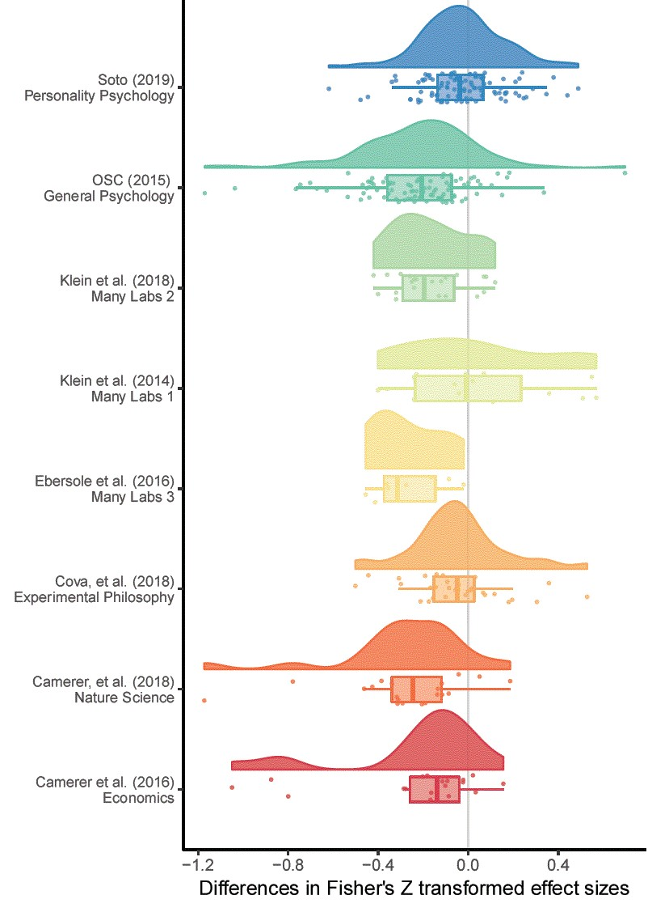

```{r message=FALSE, warning=FALSE, include=FALSE}
source(file = 'Data/data_collection_cleaning.R')
source(file = 'simplifiedAnalysisScript.R')
options(scipen = 1, digits = 2)
knitr::opts_chunk$set(fig.width=8, fig.height=5, echo =FALSE) 
options(knitr.kable.NA = '')
```

## Introduction
See word document 


## Methods 
### Data extraction
All eight published or in press large scale replication projects performed within in the behavioral science research literature were included in the current research (see Table 1 for a list of the included studies and their sample size determination methods). The original source of each replicated effect, reported test statistics, effect sizes, sample sizes, standard errors and p-values were extracted for each original and replication study. Several of the large scale replication projects did not present the original test statistics and p values (e.g., Many labs 1 and 3 {Klein, 2014 #988;Ebersole, 2016 #985}). In these cases, these values were manually extracted from the original articles. When sample sizes for original studies were not reported in the data provided by each replication project they were manually extracted from original articles where possible.

For analysis, the original and replication effect sizes were transformed to Fisher z Transformed correlation coefficients following the methods used in {Open Science Collaboration, 2015 #611}. Cases where the study-level results were not reported in correlation coefficients, Cohen's d values, as t-tests, or as F statistics were excluded from analysis (e.g., cases when no effect size was reported or when results were only reported in Cohen's q values were excluded). In cases where sample sizes were not reported per group, sample sizes among groups were assumed to be equal in these conversions. See supplementary materials 1 for a comprehensive account of exclusions and study specific extraction details for each replication project. See Table 1 for the number of valid studies extracted from each project. An original and replication effect size that could be converted to a Fisher z score along with sample sizes for original and replication studies was extracted for a total of `r sum(!is.na(allData$fis.o) & !is.na(allData$fis.r) & !is.na(allData$n.o) & !is.na(allData$n.r) )` studies. 

```{r message=FALSE, warning=FALSE}
# Table 1. A list of each included replication project, the number of replication studies performed as a part of each replication project, the percentage of replication studies which were "successful" (defined here as replication studies which found statistically significant in the same direction as the original study), the number of studies for which are included in the current study, and the percentage of each project's studies which are included in the current analysis.

# kable(replicationProjects)

# Note: $_a$ Soto et al’s (2018)’s replication rate and was recalculated on the “study” level (i.e., using the number of replicated effects not the number of trait-outcome associations as is reported in the paper) using results disattenuated using the Spearman-Brown prediction formula and Spearman disattenuation formula (Lord & Novick, 1968) to account for less reliable shorter form measures used in the replication studies. $_b$ Klein et al. (2014) includes 4 operationalisations of a single effect which were input separately for analysis in the current study, the bracketed values in the table refer to the number of results at the effect level. 
```


### Analysis

This paper uses three analytic approaches to examine the change in effect sizes from original to replication studies. All analysis was performed in R version 3.5.1 {R Development Core Team, 2018 #314} and meta-analyses were performed using the Metafor package {Viechtbauer, 2010 #796} using restricted maximum-likelihood estimation. All analyses and difference scores (i.e., proportion changes and mean differences) were calculated using Fisher Z transformed effect sizes, and effect sizes are back transformed to correlation coefficients for easy interpretation unless otherwise stated. All analyses were exploratory, and multiple models which were developed are not presented here. See https://github.com/fsingletonthorn/effectSizeAdjustment for a git repository with a record of all interim models and for all model code and data, and see https://osf.io/daj8b for the preregistration of this project specifying that all analyses would be exploratory.

##### Analysis 1: Multilevel random effects meta-analysis 

The first approach uses a random effects meta-analysis framework to estimate the expected effect size decrease between original and replication studies.

$difference_{j} = \gamma_0  + u_{id} + u_{article} + u_{project} + e_{j}$

This analysis treats each pair of effects, the original and replicated sample size, as one "study" in a meta-analytic framework, and estimates the change from original to replication study ($differnce_{j}$). In order to account for non-independence between the included difference scores, random effects for replication project ($\eta_{project}$) and original article ($\eta_{article}$) are included (as in some cases, multiple effects from an original article were replicated or multiple operationalisations of an original effect were tested), and random effects are also included for each individual effect ($\eta_{id}$). Standard errors for each difference score were estimated as $se = \sqrt{\frac{1}{N_{1} -3} +  \frac{1}{N_{2} -3} }$, with $N_1$ being the sample size in the original study and $N_2$ being the sample size in the replication study. This standard error is an approximation for the included F tests with a $df_1$ greater than 1 and chi square tests, and in order to check whether this was strongly impacting results all multilevel meta-analyses were re-performed excluding these studies. No differences in the substantive interpretation of results would follow from this change (i.e., none of the beta coefficients changed by more than `r round(max(validSEDiff), 3)`, no statistical tests changed their statistical significance at the .05 level, and variance partitioning did not change enough to alter their interpretation). Empirical Bayes estimates and 95% credible intervals for random effects were calculated following {Robinson, 1991 #999}{Morris, 1983 #1000}.

#### Accounting for null results

An important question in assessing the degree to which effects are attenuated in this literature is how much this effect is driven by the presence of a subset of null effects. The average attenuation could be extremely high, and yet this effect be almost entirely driven by the presence of effectively-null effects. In order to account for this issue, three main methods are used.

##### Analysis 2 and 3:  Multilevel random effects meta-analysis with exclusions

The first method is to re-perform the meta-analysis excluding studies using two exclusion criteria; (a) excluding studies in which the replication study was not significant and (b) removing statistically equivalent studies. Because both of these methods function by removing small replication effects, no significance testing was performed on the difference between the model estimates estimated  after accounting for small or near-null effects. 

Method (a), excluding studies in which the replication study was not significant, means that replication studies which have a low level of statistical power to detect the true effect size under study are likely to be excluded. Especially as in some of the replication projects the sample size in the replication study was chosen using a power analysis of the observed effect in the original study {Open Science Collaboration, 2015 #611}, this method is likely to underestimate the amount of effect size exaggeration due to the exclusion of under-powered replications. 

Method (b) was used to avoid excluding under-powered studies erroneously. Method (b) excludes studies based on whether the results are statistically equivalant to the null, or statistically significant in the opposite direction {Lakens, 2017 #214;Lakens, 2018 #951}. As a requirement for equivalence testing is that an equivilance bound is selected, we follow one suggestion in {Lakens, 2018 #951} and use the lowest effect size that would be statistically significant to the original study (assuming an alpha of .05). Equivalence tests were performed using Z tests of the Fisher Z transformed effect sizes, excluding studies where the observed replication effect is significantly smaller than the equivilance bound using a one tailed test at the 95% confidence level. Standard errors of each study were estimated as $\sqrt{\frac{1}{n-3}}$, except for studies from {Camerer, 2018 #967} which had more than a single replication attempt, where standard errors are those derived from the meta-analyses that produced the effect size estimate (see supplementary materials [exclusion rules] for details). 

In interpreting results based on this exclusion criterion, it is important to note that the minimum detectable effect was occasionally quite high as original sample sizes were often very small (mean equivalence bound in correlation coefficient terms = `r ztor(mean(minimumEffectDetectableZ,na.rm=T))`, SD =  `r sd(ztor(minimumEffectDetectableZ),na.rm=T)`, 0th, 25th, 50th, 75th and 100th quintiles = [`r quantile(ztor(minimumEffectDetectableZ),na.rm=T)`]). This means that original studies were sometimes under-powered to detect even large effects using the current analysis, and as such this method may exclude studies which have replication effects the original authors may have considered important. See supplementary materials 2 for scatter plots of the data-set using each exclusion rule. 

##### Analysis 4: Bayesian mixture model

The final approach to estimating the amount of effect size attenuation expected given that the effect under study is non-zero was the Bayesian mixture model presented in {Camerer, 2018 #967}. This model assumes that the each observed replication effect size  comes from one of two components, either from the null hypothesis or from the alternative hypothesis. If the replication effect size is drawn from the null hypothesis, it is assumed to have come from a normal distribution with a mean of the true effect size (a value sampled from a distribution with a mean of 0 and a modeled standard deviation) and a standard deviation equal to the standard error of the replication study (estimated here as $\sqrt{\frac{1}{n-3}}$, n being the replication sample size). If the replication effect size is sampled from the alternative distribution, it is assumed to have been drawn from a normal distribution with a standard deviation equal to the standard error of the replication study, and a mean equal to the true effect size. In this case, the true effect size is sampled from a normal distribution with a mean equal to the original study's estimated true effect size attenuated by an "attenuation factor", equal to some value between zero and one and assumed to be equal across all studies. There are two main parameters of interest in this model; the "attenuation factor" (called a deflation factor in {Camerer, 2018 #967}), the degree to which effect sizes are attenuated between original and replication study, and the overall rate at which studies are assigned to have come from the null hypothesis (the "assignment rate"). This analysis was performed in JAGS version 4.3.0 {Depaoli, 2016 #1010} using the rjags interface (version 4.8.0; {Plummer, 2018 #1011}). See supplementary materials ["mixture model"] for model syntax and further analysis details.

### Descriptives

Looking at the `r tableReductions["Overall", "n included"]` replications for which both original and replication effect sizes were available, the effect size seen in the replication study was lower than that seen in the original study in `r sum(allData$fisherZDiff < 0, na.rm = T)` articles, `r round(mean(allData$fisherZDiff < 0, na.rm = T)*100)`% of the included studies. An exact binomial test shows that this is extremely unlikely under the assumption that effect size differences should be symmetrical around 0, p = `r if(binom.test(sum(allData$fisherZDiff < 0, na.rm = T), tableReductions["Overall", "n included"])$p.value < .001) "< .001"`. The average effect size for original studies was r = `r tableReductions["Overall", "Mean original ES"]`, and the mean effect size for replication studies was r = `r tableReductions["Overall", "Mean replication ES"]`, a mean decrease of r = `r tableReductions["Overall", "Mean original ES"] - tableReductions["Overall", "Mean replication ES"]`. Notably, this represents an average decrease in effect sizes from the original to the replication study of  `r abs(round( tableReductions["Overall", "Mean proportion change"]*100))`%. See Table 2 for a comprehensive list of descriptives on the effect size differences seen,  Figure 1 for a scatterplot of the replication effect sizes plotted against the original studies' and Figure 2 for a raincloud plot of the Fisher Z score change in effect sizes by replication project.


Examining just the `r tableReductions["StatisticalSignificance", "n included"]` replications in which the replication study was statistically significant, `r round(tableReductions["StatisticalSignificance", "n included"]/tableReductions["Overall", "n included"],2) * 100`% of all studies, the average effect for original studies was `r tableReductions["StatisticalSignificance", "Mean original ES"]`, and the mean effect size for replication studies was `r tableReductions["StatisticalSignificance", "Mean replication ES"]`. This represents a mean decrease of r = `r tableReductions["StatisticalSignificance", "Mean original ES"]-tableReductions["StatisticalSignificance", "Mean replication ES"]`, a mean percentage increase in effect sizes of `r abs(round( tableReductions["StatisticalSignificance", "Mean proportion change"]*100))`% and a median decrease of `r abs(round(tableReductions["StatisticalSignificance", "Median proportion change"]*100))`%. Using equivalence testing, a total of `r tableReductions["Nonequivalence", "n included"]` studies were not statistically equivalent to the null, `r round(( tableReductions["Nonequivalence", "n included"]/ nrow(allData))*100)`% of included studies. The average effect size in the original non-equivalent studies was `r tableReductions["Nonequivalence", "Mean original ES"]`, compared to a mean effect size for replication studies of r = `r tableReductions["Nonequivalence", "Mean replication ES"]`. This is a mean decrease of r = `r tableReductions["Nonequivalence", "Mean original ES"] - tableReductions["Nonequivalence", "Mean replication ES"]`, a mean percentage decrease of  `r abs(round(tableReductions["Nonequivalence", "Mean proportion change"]*100))`%,  and a median decrease of `r abs(round(tableReductions["Nonequivalence", "Median proportion change"]*100))`%.


```{r}
plotAllData
```

Figure 1. A scatterplot of replication study effect sizes (in correlation coefficients) plotted against original study effect sizes. Points which fall on the solid, diagonal line represent replication effect sizes equal to the original effect sizes. Point size represents (the log) of the number of participants in the replication study, and the colour of the points shows which replication project each effect size pair was from. 



Figure 2. A raincloud plot of the change in effect sizes (here Fisher Z scores) from the original to the replication study by the replication project that each replication study was performed as a part of. 


Table 2. 
Differences between original and replication studies. All calculations were performed on Fisher's Z transformed correlations and presented effect sizes are back-transformed into correlation coefficients for interpretability.

```{r, echo = F}
kable( t(tableReductions), digits = 2, col.names = c("All studies", "statistically significant replications", "Nonequivalent studies"))
meanDecrease <- tableReductions$`Mean ES difference`[1]
meanPropDecrease <- tableReductions$`Mean proportion change`[1]
rangeDiffNotOverall <- range(tableReductions$`Mean ES difference`[2:nrow(tableReductions)])
rangePropDiffNotOverall <- range(tableReductions$`Mean proportion change`[2:nrow(tableReductions)])

```


### Results
#### Analysis 1: Multilevel random effects meta-analysis results

The random effects meta-analysis including all data estimates a r = `r REModSum$estimate_Cor` (95% CI [`r REModSum$CI95_Cor`]) decrease in effect sizes from the original to replication studies. This represents a decrease equivalent to `r abs(round( (REModSum$estimate_Z/mean(allData$fis.o, na.rm = T))*100))`% (95% CI [`r abs(round( ((REModSum$CI95_Z/mean(allData$fis.o, na.rm = T))*100)[1]))`%, `r abs(round( ((REModSum$CI95_Z/mean(allData$fis.o, na.rm = T))*100)[2]))`%]) of the mean effect size in the original studies (a Fisher Z transformed correlation coefficient equivalent to a correlation coefficient of `r mean(allData$correlation.o, na.rm = T)`). 

```{r}
options(scipen = 1, digits = 3)
```

More variance is attributable to the article and effect level than to the project ($\sigma^2_{article}$ = `r round(REMod$sigma2[2], 3)`, $\sigma^2_{effect}$ = `r round(REMod$sigma2[3], 3)`, compared to $\sigma^2_{project}$ = `r round(REMod$sigma2[1], 3)`), representing an intraclass correlation (ICC) for the project of `r round(REMod$sigma2[1] / sum(REMod$sigma2), 3)`. QE tests of heterogeneity suggest that there is a large amount of unexplained heterogeneity, `r niceREModSum[5, "Random effects"]`, and an $I^2$ of `r Io2` (calculated following {Nakagawa, 2012 #1023}), suggesting that `r round(Io2)`% of variance in effect sizes is due to heterogeneity (i.e., variance in the true effect size differences), while the remaining `r 100-round(Io2)`%  is attributable to sampling variance. 

Table [nice mod sum]. Model output from a multilevel random effects meta-analysis of the difference between original and replication effect sizes, with random effects for the project (i.e., which large scale replication project the replication was a part of) and the original (i.e., replicated) article or effect. 

```{r table model summary}
kable(niceREModSum)
```

\n 

```{r blup}
# Table [BLUP]. Empirical Bayes estimates and 95% credible intervals for random effects (i.e., estimates of the difference between the replication project's mean effect size difference and the overall estimated mean effect size difference). These values are equivalent to 95% confidence intervals assuming that the studies are a random sample from a population with normally distributed average effect size difference.

# blups <- BLUPsSource[[1]]
# row.names(blups) <- str_remove_all(row.names(blups), "\\n")
# kable(blups, col.names = c("Estimate", "Standard Error", "95% PI lower bound", "95% PI upper bound"))

options(scipen = 1, digits = 2)
```

#### Analysis 2 - 3: Results from multilevel random effects meta-analysis with exclusions 

Looking at the estimated effect size decrease only including replications with statistically significant findings, there is an estimated r = `r modSumariesR$modelEstimate[2]` (95% CI [`r modSumariesR$MLM95lb[2]`, `r modSumariesR$MLM95ub[2]`]) change in effect sizes from original to replication studies. Including only the statistically equivalent studies predicts an r = `r modSumariesR$modelEstimate[3]` (95% CI [`r modSumariesR$MLM95lb[3]`, `r modSumariesR$MLM95ub[3]`]) decrease in effect sizes.  The estimates of the proportion of variance attributable to the article or replication project level did not change considerably in either of these subsets. See table [all model output] for the model estimates from each model.

These values represent changes  equivalent to a decrease of `r abs(round( ( modRes1$modelEstimate / mean(allData$fis.o, na.rm = T))*100))` to `r abs(round(( modRes2$modelEstimate / mean(allData$fis.o, na.rm = T))*100))`% of the average original effect size (a correlation coefficient of r = `r ztor(mean(allData$fis.o, na.rm = T))`). Looking at the range of the 95% confidence intervals for both of these subsamples, the coverage extends from a considerable decrease equivalent to `r abs(round(( modRes2$MLM95lb  / mean(allData$fis.o, na.rm = T))*100))`% of the average original correlation, to a small increase in effect sizes equivalent to `r round(( modRes1$MLM95ub  / mean(allData$fis.o, na.rm = T))*100)`% of the average original effect size.

##### Table [all model output]
The number of studies included in each model, and the estimated correlation coefficient decrease from each model. Models were estimated using Fisher Z transformed correlation coefficients and back transformed for interpretability. Percentage attenuation gives the percentage attenuation for effect size differences as a percentage of the mean original effect size (r = `r mean(allData$correlation.o, na.rm = T)`). 
```{r echo=F}

options(scipen = 1, digits = 2)

colNames <- row.names(modSumariesR) %>% 
        str_replace("Below", " < ") %>%
        str_replace("Above", " > ") %>% 
        str_replace("Significance", "ly significant replications") %>%
        str_replace("Nonequivalence", "Nonequivalent studies") %>%
        str_replace("Overall", "All studies")

rowNames <- c( str_replace(str_replace(names(modSumariesR), "model", "Model "), "MLM95", "95% CI "))

kable(data.frame(rowNames, t(modSumariesR)), col.names = c( NA, colNames), row.names = F)

```

##### Leave one out cross validation of meta-analyses
To assess how sensitive the results of the multilevel models are to the inclusion of each of the replication projects, the included studies, and the individual replicated effects, all of the above multilevel models were rerun using leave one out cross validation, excluding both each effect, effects from each original study (i.e., in cases where multiple effects were tested from the same original source), and each replication project one at a time. None of these analyses led to model estimates (i.e., the expected decrease in effect size between original and replication study or equivalently the intercept estimate) that were further than `r LooMaxDiff` from those given above, suggesting that none of the individual projects, effects or studies included were overly influential. See supplementary material [LOO] for tables summarising the leave-one-out model output. 

#### Analysis 4: Bayesian mixture model results

The Bayesian mixture model was estimated using four Markov chains from each of which 100,000 draws were taken (excluding a 11,000 draw burn-in period). Trace and density plots for the discussed parameters were assessed and the model appeared to have successfully converged. The overall posterior assignment rate (i.e., the proportion of studies which are estimated to be from the non-null alternative hypothesis) is `r round(phiSimple,2)*100`%, with a 95% highest probability density interval of [`r round(phiSimpleHDI, 2 )[1] * 100`%, `r round(phiSimpleHDI, 2 )[2] * 100`%]. The overall attenuation factor (i.e., the estimated amount that effect sizes decreases between the original and replication studies) is `r round((1-as.numeric(alphaSimple))*100)`% with a 95% highest probability density interval of [`r  (1-round(as.numeric(HDISimple)[2], 2))*100`%, `r  (1-round(as.numeric(HDISimple)[1], 2))*100`%]. Figure [mixture model], shows the original effect sizes plotted against replication effect sizes weighted by sample size, along with the posterior assignment rate. The color of each point indicates how often each effect was assigned to the alternative hypothesis. 

As was seen and pointed out in the first use of this model in {Camerer, 2018 #967}, values close to the diagonal (i.e., cases in which the original and replication effect sizes are similar) are reliably assigned to the alternative hypothesis whereas effects far below the diagonal are more often assigned to the null hypothesis. The overall posterior assignment rate might be overly optimistic (i.e., assign studies to the non-null hypothesis at a high rate). In part, the high posterior assignment rate may be due to the fact that this model allows for "true" effect sizes to be estimated as being extremely low or near zero and assigned to the alternative hypothesis, with `r round(propBelow.1.BMM, 2) * 100`% of the estimated "true" replication effect sizes being smaller than a correlation coefficient of .1.

```{r}
mixtureModelPlot
```

###### Figure [mixture model]. 
A scatterplot of replication study effect sizes (in correlation coefficients) plotted against original study effect sizes, colored by the posterior assignment rate, the proportion of times each study was assigned to the alternative hypothesis. Points which fall on the solid, diagonal line represent replication effect sizes equal to the original effect sizes. Point size represents (the log) of the number of participants in the replication study.

## Discussion 

These results show that there was a substantial average decrease in effects sizes between the original and replication study and suggest that this is still the case even after accounting for the presence of non-zero effects. The results of the multilevel meta-analysis results show an estimated mean decrease of r = `r REModSum$estimate_Cor`, (95% CI [`r REModSum$CI95_Cor`]), equivalent to a `r REModSum$estimate_D` point Cohen's d decrease (95% CI [`r REModSum$CI95_d`]), or an estimated decrease of `r abs(round((REModSum$estimate_Z/mean(allData$fis.o, na.rm = T)),2))*100`%  (95% CI [`r abs(round((REModSum$CI95_Z/mean(allData$fis.o, na.rm = T))*100))[1]`%, `r abs(round((REModSum$CI95_Z/mean(allData$fis.o, na.rm = T))*100)[2])`%]) of the mean effect size in the original studies (a $Fisher_Z$ equivalent to r = `r ztor(mean(allData$fis.o, na.rm = T))`). 

Arguably of more interest to researchers examining and planning research is the question of the degree of effect size attenuation expected under the assumption that the effect size is non-zero. All of the methods used here largely agree, although the degree of precision differs. The Bayesian mixture model estimates that there is an average decrease of `r round((1-as.numeric(alphaSimple))*100)`%, with a 95% highest probability density interval of [`r  (1-round(as.numeric(HDISimple)[2], 2))*100`%, `r  (1-round(as.numeric(HDISimple)[1], 2))*100`%]. The multilevel models estimated excluding data lead to similar conclusions, although they highlight the degree of uncertainty in this result. All models estimated using data-exclusions show a lower effect size decrease when attempting to exclude null (or effectively null) effects with the confidence intervals over both of these models extending from a decrease of r = `r ztor(min(modSumariesR$MLM95lb[-1]))` to an increase of r = `r ztor(max(modSumariesR$MLM95ub[-1]))`. 

```{r}
catPlot 
```

Figure x. A caterpillar plot of the effect size difference between original and replication study effect sizes ordered by magnitude, error bars are 95% confidence intervals around effect size differences.

#### Limitations and future directions

None of the projects included in this analysis were true random selections from the literature, and it is possible that the selected sample may be systematically different than that which would be seen in the literature overall. However, this preliminary analysis does provide suggestive evidence that the degree of effect size attenuation that is seen may be partially attributed to the presence of effectively-null results, and that the overall decrease in effect sizes in non-null studies may still be considerable. The current study does not attempt to distinguish between effect size heterogeneity (i.e., effect sizes that are different under different experimental conditions) and effect size attenuation. However, it seems reasonable to except in that effect size heterogeneity should lead to symmetrical effect size differences, and in so far as it might be expected to be negatively biased in replication studies, this could reasonably be termed effect size attenuation for the purposes of researchers hoping to replicate or plan future similar studies of the same type of effects. 

The Bayesian mixture model used here has two major issues. Firstly, it assumes independence between effects and a uniform attenuation factor across all areas of psychological research. Secondly, the modeled true effect size can be negligible or even negative and the replication effect size still assumed to be sampled from the alternative distribution not the null. Future reserach could help develop a more nuanced account of the data-generation process that leads to this data-set by for example building a model that allows for the attenuation rate to change across replication studies, possibly including more components allowing for studies with negligible or negative but non-null effects in addition to the true alternative and null components modeled in the current research.

### Conclusion 

Researchers should be aware that their experiments are likely to be under-powered if they plan their sample sizes using the effect size reported in a previous experiment. As a conservative heuristic for researchers performing formal sample size planning such as power analysis on the basis of previous research, researchers could follow the advice given in {Camerer, 2018 #967} and plan their experiments assuming that the true effect size is 50% of a reported effect size, a value matched by the more extreme 95% confidence interval of the estimated amount of effect size exaggeration across studies in this sample. Alternatively, it may be preferable to use methods of sample size planning that do not rely on precise a priori estimation of the effect size under study, such as planning studies to reliably detect the smallest effect size of interest {Lakens, 2018 #951}, using sequential analysis strategies {Pocock, 1977 #553;Lakens, 2014 #169}, or planning for adequate precision in parameter estimates across a range of possible effect sizes {Maxwell, 2008 #559;Kelley, 2017 #727}.

This research also emphasizes the importance of efforts to reduce publication and reporting biases, many of which individual researchers can voluntarily and easily take part in. Firstly, data-sharing platforms such as figshare (figshare.com) and the Open Science Framework (osf.io) make it possible for researchers to easily share the results of research whether or not it ends up being published in a traditional journal. Secondly, pre-prints allow researchers to report and publicize reports and data that may otherwise remain in the file draw, making it easier to ensure that non-significant results are accessible to other researchers and meta-analysts. Thirdly, multinational collaborative effects such as the Psychological Science Accelerator {Moshontz, 2018 #1025} and the Many Babies project {Frank, 2017 #1016} make it possible for extremely large sample research to be conducted, even with samples that are usually difficult to recruit such as infants. Finally, projects like registered reports, in which papers are reviewed before data-collection on the basis of the design and analysis strategy as opposed to the results, also show promise in helping to develop a body of literature which is not effected by reporting and publication bias {Nosek, 2014 #202}. However, until large bodies of research free of publication bias become available, researchers should be aware that effect sizes in published studies are on average, considerably overstated.

## Supplementary material 
## SM1 
###  Replication project Extraction and exclusion details

##### {Open Science Collaboration, 2015 #611}
Three original studies which did not report that their findings were indicative of a non-zero effect were excluded from those studies extracted from {Open Science Collaboration, 2015 #611}. Three studies for which z transformed correlation coefficients could not be extracted due to missing data in the downloaded data set were also excluded from analysis. Effect sizes for original and replication studies are included for `r nrow(data)` out of 97 studies replicated studies from {Open Science Collaboration, 2015 #611} which reported having found a non-zero effect. 

##### {Camerer, 2018 #967}
Original and replication effect sizes were extracted for all `r nrow(data4)` studies included in {Camerer, 2018 #967}. In some cases in the Nature Science reproducibility project {Camerer, 2018 #967} multiple replication studies were performed for a single effect. In each of these cases we performed a fixed effects meta-analysis using the metafor package {Viechtbauer, 2010 #796} to estimate a meta-analytic effect size estimate. The effect size, standard errors and sample sizes used in the current study reflect this pooled estimate. This method leads to one study more "replicating" according to the 'statistical significance in the same direction of the original study' criterion than was originally reported in {Camerer, 2018 #967}, where they used the p value from the largest performed study instead of a pooled estimate. 

##### {Soto, in press #1032} 
Effect sizes were extracted for original and replication studies for `r sum(!is.na(data7$correlation.o) & !is.na(data7$correlation.r))` out of `r nrow(loopr)` included studies, and one original study's sample size was not available. In {Soto, in press #1032} Effect sizes which were only reported in this dataset as beta coefficients were not converted to Fisher z scores as not enough information was available in the data set. A total of `r sum(allData$abrev == "loopr")` of 121 effects were included in the current analysis. As some replication studies used shorter form versions of the original data collection instruments, all results presented have been disattenuated using the Spearman-Brown prediction formula and Spearman disattenuation formula to estimate the trait-outcome associations that would be expected if our outcome measure had used the same number of items as the original study (Lord & Novick, 1968). Following the other large scale replication studies, the signs of the original and replication study effects were switched if the original effect was negative. 

##### {Cova, 2018 #984}
{Cova, 2018 #984} included three replications of original studies which were non-significant (and which did not claim to provide evidence for the effects under test), these were removed from analysis. Effect sizes were reported by Cova et al. (2018) and are included in the current study for `r sum(!is.na(data6$fis.o) & !is.na(data6$fis.r) & !is.na(data6$n.o) & !is.na(data6$n.r))`, original and replication studies, out of an original 37 replicated studies with significant original results. The four studies for which no effect sizes were reported performed analyses for which Cova et al. (2018) could not develop reasonable effect size estiamtes (e.g., a Sobel test, GEE analysis). 

##### Many labs 1 {Klein, 2014 #988}
Many labs 1 {Klein, 2014 #988} examined whether effects from 13 original papers replicated, one of which did not report an effect size or  test statistic so is not included in the current sample. No effect size was extractable for one original study, and this effect was excluded for the purposes of the current analysis. Four different operationalisations of anchoring effects were tested, all of which are included in the current analysis, leading to a total of 15 paired data-points being included from this study. The multilevel models reported below accounts for non-independence between effects by including a random effect for study. 

##### Many labs 2 {Klein, 2018 #1021}
A total of `r nrow(data8)` of `r nrow(data8) + 6 ` paired original and replication effects sizes are included for this analysis. Four studies from {Klein, 2018 #1021}  were removed because the original and replication studies examined a difference in effect sizes seen in different conditions, and the effects were not directly tested against each other making it difficult to derive an appropriate effect size. Two additional studies were excluded because their effect sizes were only available as Cohen's q.

##### {Ebersole, 2016 #985}
Original and replication effect sizes were extracted for all 9 original and replication studies from {Ebersole, 2016 #985}, excluding a study they term a "conceptual replication". Most effects (6/9) were converted to correlation coefficients from the Cohen's d values reported in this replication project. The results of three additional studies reported as partial Eta squared were converted to correlation coefficients from F statistics using the formula: 

$r\  =\ \sqrt{\frac{F_{obs}\times(df_1 / df_2)}{F_{obs} \times (df_1 / df_2) + 1}} \times \sqrt{\frac{1}{df_1}}$

##### {Camerer, 2016 #983}
The economics replication project {Camerer, 2016 #983}. Original and replication effect sizes for all `r sum(allData$abrev == 'econ')` studies were reported in correlation coefficients and all are included in this analysis.


### SM2 
### Plots and multilevel model output of the relationship between original and replication correlation coefficients using varied exclusion criteria

The following output shows scatter plots and model output for all of the multilevel meta-analyses performed using the varied exclusion criteria explained in the main text.

Table SM `r tabSMN <- 1; tabSMN`. Multilevel meta-analysis model estimates and random effects for all data.

```{r}
kable(niceModelSums$`All Data`)
```

```{r}
plotAllData 
```

Figure SM`r figSMN <- 1; figSMN`. Scatter plot of replication effect sizes (in correlation coefficients) plotted against original effects including all data.


Table SM`r tabSMN <- tabSMN + 1; tabSMN`. Multilevel meta-analysis model estimates and random effects including only statistically significant replications. 

```{r}
kable(niceModelSums$`Only Signficant replications`)
```


```{r}
plotSigR 
```

Figure SM`r figSMN <- figSMN+1; figSMN`. Scatter plot of replication effect sizes (in correlation coefficients) plotted against original effects including only statistically significant replications. 


Table SM`r tabSMN <- tabSMN + 1; tabSMN`. Multilevel meta-analysis model estimates and random effects including studies which are not statistically equivalent to the null, using equivalence bounds set as the minimum effect size that would have been statistically significant in the original study. 

```{r}
kable(niceModelSums$`Non-equivalent studies`)
```

```{r}
plotNonequiv 
```

Figure SM`r figSMN <- figSMN+1; figSMN`. Scatter plot of replication effect sizes (in correlation coefficients) plotted against original effects including studies which are not statistically equivalent to the null, using equivalence bounds set as the minimum effect size that would have been statistically significant in the original study.


### SM3
#### LOO Cross validation output

#### Table [LOO cross validation output].
0th, 25th, 50th, 75th and 100th percentiles from leave one out cross validation for each multilevel model, for each exclusion method an, including only the sample indicated in "LOO exclusions". 

```{r}
kable(LOOoutput)
```

### SM4
#### Bayesian Mixture Model

The mixture model results presented in text presents the model developed by Camerer et al,. (2018; see https://osf.io/xhj4d/ for their detailed description of this model).  All priors were chosen to be uninformative or vague. The mixture model assumes that the observed replication effect sizes either come from the null hypothesis, a true effect sampled from a normal distribution with a mean of zero and a estimated precision (tau). This model uses an errors-in-variables approach to account for possible attenuation of effect sizes due to measurement error and estimation uncertainty following {Matzke, 2017 #1012}, which means the effect size attenuation factor is the factor change between the estimated true effect of the original and replication study effect size. Although this may be reasonable in that the true effect size of the effect may not be the true effect size of a particular study and analysis set up, this poses an interpretative problem in that alpha now represents the difference between the estimated original effect and the replication effect.

Box SM1. The original model reported in {Camerer, 2018 #967} and reported on in the main text of the current article. 

```{}
model{
# Mixture Model Priors:
alpha ~ dunif(0,1) # flat prior on slope for predicted effect size under H1
tau ~ dgamma(0.001,0.001) # vague prior on study precision
phi ~ dbeta(1, 1) # flat prior on the true effect rate
# prior on true effect size of original studies:
for (i in 1:n){
trueOrgEffect[i] ~ dnorm(0, 1)
}
# Mixture Model Likelihood:
for(i in 1:n){
clust[i] ~ dbern(phi)
# extract errors in variables (FT stands for Fisher-transformed):
orgEffect_FT[i] ~ dnorm(trueOrgEffect[i], orgTau[i])
repEffect_FT[i] ~ dnorm(trueRepEffect[i], repTau[i])
trueRepEffect[i] ~ dnorm(mu[i], tau)
# if clust[i] = 0 then H0 is true; if clust[i] = 1 then H1 is true and
# the replication effect is a function of the original effect:
mu[i] <- alpha * trueOrgEffect[i] * equals(clust[i], 1)
# when clust[i] = 0, then mu[i] = 0;
# when clust[i] = 1, then mu[i] = alpha * trueOrgEffect[i]
  }
}
```


